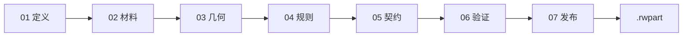
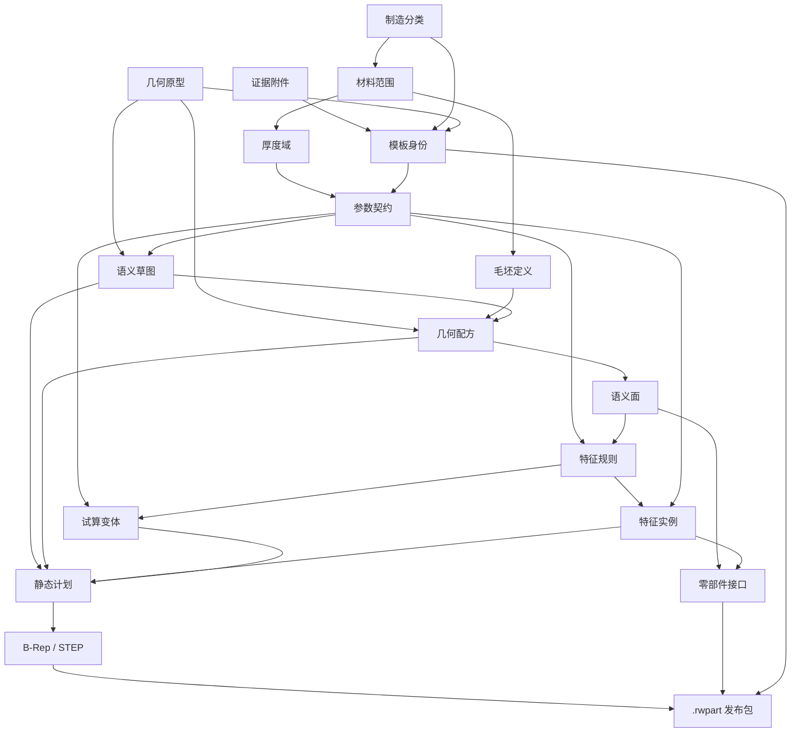
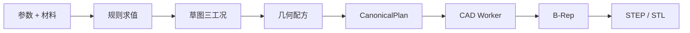

# 单体零部件模板生成总图

> 来源：Canvas「模板生成总图」  
> 适用范围：RuiWare 单体零部件模板工程平台（元模型 3.0）  
> 说明：七个阶段是作者路径；依赖图是数据关系；表格列出每条数据由谁产生、驱动谁、被谁消费。上游指纹变化会使下游阶段失效，必须重新确认。

这不是一次画出固定零件。模板定义一族可变化实例：基体由草图和配方保持稳定，孔槽由规则按参数展开，CAD 只编译已经展开的静态计划。

| 工程阶段 | 核心数据对象 | 最终交付 |
| ---: | ---: | --- |
| 7 | 18 | `.rwpart` |

---

## 1. 作者路径总览

```text
新建草稿
  → 01 定义（身份、工艺、几何原型、图纸）
  → 02 材料（允许什么料、厚度、毛坯）
  → 03 几何（草图 + 配方 + 语义面）
  → 04 规则（孔/槽/切口如何随参数生成）
  → 05 契约（公开参数、接口、试算）
  → 06 验证（OpenCascade 编译出 STEP）
  → 07 发布（冻结不可变版本）
        ↓
下游设计平台只消费已发布模板，生成零件实例
```



---

## 2. 各阶段：功能、需要的数据、产出与关系

### 01 定义

**功能：** 确定模板身份、单体范围、主工艺和初始几何构造方式；上传图纸与图片作为证据，不把图片当作几何真值。

**需要：**

- 模板编码、名称、负责人、组织
- 零部件来源与主成形工艺、后续工序
- 初始几何原型（开口薄壁、闭口管、平板等）
- 用途说明、设计约束
- 截面图 / 三维图 / 图纸附件

**产出：** 模板身份、制造分类、几何原型、证据附件

**数据关系：** 几何原型决定后续草图模式和第一个 CAD 算子；制造分类约束材料供应形态与毛坯路线；证据只被审查引用，不进入 B-Rep。

### 02 材料

**功能：** 声明模板允许什么材料、厚度如何取值、毛坯从何种供应状态进入主工序，并用代表材料做验证矩阵。

**需要：**

- 制造分类中的供应形态暗示
- 材料库只读记录（`ruiware.db`）
- 类别 / 材料族 / 唯一记录
- 允许厚度值或上下限
- 毛坯准备工序与尺寸表达式

**产出：** 材料适用范围、有效厚度域、毛坯定义、材料验证样例

**数据关系：** 厚度域绑定参数 `thickness`；标称材料样例供 CAD 编译；毛坯尺寸表达式引用模板参数。材料库不被模板改写。

### 03 几何

**功能：** 把截面建成带稳定 ID 的语义草图，用约束和参数尺寸驱动，再由几何配方生成基体，并声明后续打孔用的语义面。

**需要：**

- 几何原型给出的草图模式与首个算子
- `length` / `sectionWidth` / `sectionHeight` / `thickness` 等参数
- 图元、约束、尺寸、加减材区域或中心线
- 最小 / 标称 / 最大三工况

**产出：** 语义草图、几何配方、语义面、草图求解结果

**数据关系：** 尺寸绑定参数 ID，不绑定中文名；配方引用草图区域或中心线；语义面 ID 被规则和接口引用，禁止用 B-Rep 面序号。

### 04 规则

**功能：** 用规则描述孔、槽、切口如何随参数生成，而不是在基体上画死固定数量的孔。

**需要：**

- 语义面及其 U/V 跨度
- 孔径、间距、端距等参数或表达式
- 布置方式（单项、阵列、均分、最大间距、对称）
- 可选生效条件

**产出：** 制造特征规则、求值后的特征实例集合

**数据关系：** 规则绑定语义面；表达式引用参数；实例带稳定规则 ID + 实例键。立柱变长则孔数变化，CAD 只遍历同一打孔算子。

### 05 契约

**功能：** 规定实例可填哪些参数、本零件向外提供哪些定位/连接基准，并用试算验证参数变化后的特征与接口。

**需要：**

- 全部参数定义（类型、来源、范围、是否公开）
- 静态语义面或来源特征规则
- 公开参数的试算覆盖值

**产出：** 参数契约、零部件接口、试算变体、规则求值报告

**数据关系：** 公开参数驱动规则和草图；特征派生接口随孔实例增减；试算不写出 STEP，只证明求值链可重复。

### 06 验证

**功能：** 把规则展开成不可变静态计划，交给隔离 CAD Worker 编译单个连续实体，输出 STEP/STL 与诊断。

**需要：**

- 当前修订的完整元模型
- 标称材料样例
- 三工况草图求解
- 特征实例集合

**产出：** CanonicalPlan、B-Rep、STEP / STL、诊断与语义映射

**数据关系：** 计划哈希覆盖几何、草图、毛坯和材料快照；预览 STL 只供人看，STEP/B-Rep 才是几何真值。

### 07 发布

**功能：** 在全部阶段通过且 CAD 有效后冻结版本。下游设计平台只消费该版本，不能改模板定义。

**需要：**

- 七阶段完成状态
- 有效单实体、正体积编译结果
- 复核人、发布通道、版本说明

**产出：** 不可变发布版本、`.rwpart` 源包

**数据关系：** 源包打入身份、参数、材料、草图、配方、规则、接口、变体、证据和 CAD 产物。再编辑必须形成新修订。

---

## 3. 阶段产出对照

| 阶段 | 功能 | 关键输入 | 关键输出 |
| --- | --- | --- | --- |
| 01 定义 | 确定模板身份、单体范围、主工艺和初始几何构造方式；上传图纸与图片作为证据，不把图片当作几何真值。 | 模板编码、名称、负责人、组织 | 模板身份、制造分类、几何原型、证据附件 |
| 02 材料 | 声明模板允许什么材料、厚度如何取值、毛坯从何种供应状态进入主工序，并用代表材料做验证矩阵。 | 制造分类中的供应形态暗示 | 材料适用范围、有效厚度域、毛坯定义、材料验证样例 |
| 03 几何 | 把截面建成带稳定 ID 的语义草图，用约束和参数尺寸驱动，再由几何配方生成基体，并声明后续打孔用的语义面。 | 几何原型给出的草图模式与首个算子 | 语义草图、几何配方、语义面、草图求解结果 |
| 04 规则 | 用规则描述孔、槽、切口如何随参数生成，而不是在基体上画死固定数量的孔。 | 语义面及其 U/V 跨度 | 制造特征规则、求值后的特征实例集合 |
| 05 契约 | 规定实例可填哪些参数、本零件向外提供哪些定位/连接基准，并用试算验证参数变化后的特征与接口。 | 全部参数定义（类型、来源、范围、是否公开） | 参数契约、零部件接口、试算变体、规则求值报告 |
| 06 验证 | 把规则展开成不可变静态计划，交给隔离 CAD Worker 编译单个连续实体，输出 STEP/STL 与诊断。 | 当前修订的完整元模型 | CanonicalPlan、B-Rep、STEP / STL、诊断与语义映射 |
| 07 发布 | 在全部阶段通过且 CAD 有效后冻结版本。下游设计平台只消费该版本，不能改模板定义。 | 七阶段完成状态 | 不可变发布版本、`.rwpart` 源包 |

---

## 4. 数据依赖图

自上而下为依赖方向。终点是编译与发布。L0 是定义/材料入口，层数越大越接近可交付产物。

核心关系可以记成：

```text
身份 + 原型 + 材料
  → 参数
  → 草图 + 配方
  → 语义面
  → 特征规则
  → 特征实例 + 接口
  → 静态计划
  → STEP
  → 发布包
```



---

## 5. 编译生成链

作者路径填表；真正出三维走这条确定性链路。网页预览和外部提案都不能绕过它。

```text
参数 + 材料
  → 规则求值
  → 草图三工况
  → 几何配方
  → CanonicalPlan
  → CAD Worker
  → B-Rep
  → STEP / STL
```



---

## 6. 数据之间的关系

| 数据 | 来源阶段 | 驱动 / 引用谁 | 被谁消费 |
| --- | --- | --- | --- |
| 模板身份 | 01 定义 | 编码作为发布索引 | 发布包、修订记录 |
| 制造分类 | 01 定义 | 约束材料形态与工艺 | 材料范围、毛坯路线 |
| 几何原型 | 01 定义 | 初始化草图模式和首个算子 | 语义草图、几何配方 |
| 证据附件 | 01 定义 | 只作审查说明 | 源包归档；不进 CAD |
| 材料范围 | 02 材料 | 过滤材料库候选 | 厚度域、验证样例 |
| 厚度域 | 02 材料 | 绑定参数 thickness | 草图壁厚、CAD 编译 |
| 毛坯定义 | 02 材料 | 引用长度/宽度/厚度参数 | 配方与工艺规划 |
| 参数契约 | 01–05 | 稳定 ID 被表达式引用 | 草图尺寸、规则、接口、试算 |
| 语义草图 | 03 几何 | 尺寸绑定参数 ID | 配方、三工况求解、计划 |
| 几何配方 | 03 几何 | 引用草图区域或中心线 | 基体实体、语义面 |
| 语义面 | 03 几何 | U/V 由面跨度表达式计算 | 特征规则、静态接口 |
| 特征规则 | 04 规则 | 引用参数 + 语义面 | 特征实例、派生接口 |
| 特征实例 | 求值时展开 | 规则 × 参数值 | CanonicalPlan 打孔算子 |
| 零部件接口 | 05 契约 | 静态面或特征派生 | 未来组件装配；写入发布包 |
| 试算变体 | 05 契约 | 覆盖公开参数 | 规则回归；标称进入编译 |
| CanonicalPlan | 06 验证 | 草图 + 配方 + 已展开特征 | CAD Worker |
| B-Rep / STEP | 06 验证 | 只接受静态计划 | 审查、发布、下游制造 |
| .rwpart 发布包 | 07 发布 | 打包上述全部契约 | 三维设计平台实例化 |

---

## 7. 必须遵守的契约

- 稳定引用只用 ID：参数 ID、图元 ID、语义面 ID、规则 ID。显示名称可改。
- B-Rep 面序号会随拓扑重建变化，不能当契约。
- 前一阶段改动后，后续“已完成”会失效，必须重新确认。
- 数据对象以当前元模型 3.0 与七阶段工作台为准。
- 回转、扫掠、放样、折弯在注册表中可选用；生产基线仍以截面拉伸、薄壁拉伸和集合孔槽为主。
